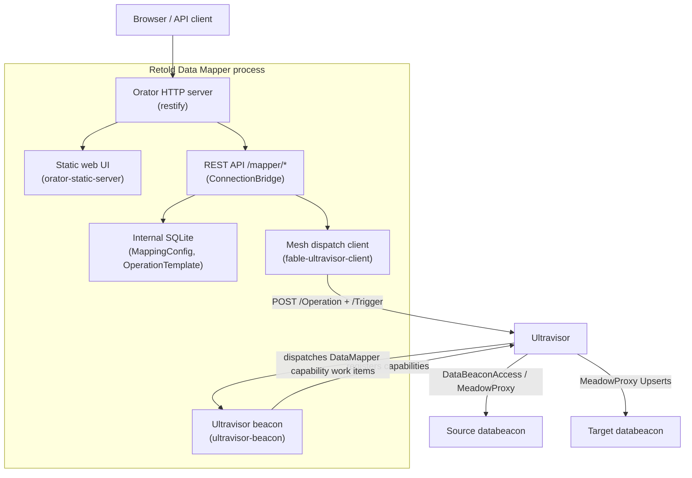
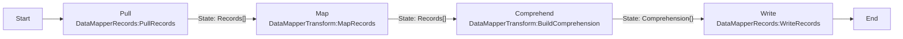

# Architecture

The Data Mapper is a beacon-server: a single long-running process that combines an HTTP API server, a static web UI, an internal database, and an Ultravisor beacon. It mediates between an operator (or a calling application) and the Ultravisor mesh, turning saved mapping intent into executed operation graphs. It never opens a connection to a source or target database itself.

## The beacon-server model

The process plays two roles at once. As a **server**, it answers REST and web-UI requests on its own port. As a **beacon**, it registers capabilities on the Ultravisor and answers work items dispatched to it. The interesting part is that a sync uses both roles in sequence: a REST call compiles and triggers an operation, and the operation's nodes come back to the Data Mapper as beacon work items.

## What runs inside the process

The service class is `source/Retold-DataMapper.js` (a `fable-serviceproviderbase` service), bootstrapped by `bin/retold-data-mapper.js`. Its public methods are `initializeService`, `connectUltravisor`, `disconnectUltravisor`, `loadModel`, `createSchema`, and `stopService`.

On `initializeService` it:

1. Starts the Orator web server (restify) with body and query parsing.
2. Optionally auto-creates the internal SQLite schema.
3. Loads its internal Meadow model (`model/MeadowModel-DataMapper.json`) and wires Meadow CRUD endpoints for those entities.
4. Wires the ConnectionBridge REST routes under `/mapper`.
5. Serves the static web UI and `pict.min.js`.
6. Optionally connects to an Ultravisor and registers its capabilities.

### Services and their roles

| Service | File | Role |
|---------|------|------|
| **RetoldDataMapper** | `Retold-DataMapper.js` | The top-level service. Owns Orator, the internal Meadow DAL, the beacon connection lifecycle, and the dispatch client handle. |
| **ConnectionBridge** | `services/DataMapper-ConnectionBridge.js` | Mounts the entire `/mapper/*` REST API. Manages the Ultravisor connection, lists beacons and connections, performs CRUD on stored mappings, and -- most importantly -- compiles mappings and operation configs into Ultravisor operation graphs and triggers them. |
| **BeaconProvider** | `services/DataMapper-BeaconProvider.js` | Registers the mesh capabilities and implements their handlers. This is what the compiled operation graphs call back into. See [Beacon Capabilities](beacon-capabilities.md). |
| **Discovery** | `services/DataMapper-Discovery.js` | Helper that introspects remote databeacons and lists their connections via the mesh, with an in-memory schema cache. |
| **Validator** | `services/DataMapper-Validator.js` | Validates entity mappings against introspected source and target schemas, returning blocking errors and type-mismatch warnings. |
| **SyncEngine** | `services/DataMapper-SyncEngine.js` | A direct read-transform-write loop over `MeadowProxy:Request` work items. Exposed on the service instance for the test suite; not part of the compiled-operation execution path. |
| **Reporter** | `services/DataMapper-Reporter.js` | Accumulates per-entity sync counts (synced, skipped, errors) for run reporting. |

> **Note on Discovery / Validator / SyncEngine / Reporter:** these four are constructed inline on the service instance (reachable as `mapper.Discovery`, `mapper.Validator`, and so on) primarily so the test suite can call them. The production sync path used by the REST API is the **compiler + operation-graph** path described below, which dispatches through the beacon capabilities -- not the SyncEngine's direct loop.

### Task type definitions and executors

The folders `source/services/definitions/*.json`, `source/services/executors/*.js`, `source/services/DataMapper-TaskConfigs.js`, and `source/services/DataMapper-CardOverrides.js` describe Data Mapper task types as flow-editor cards for the Ultravisor's `TaskTypeRegistry`. In the shipped `serve` path these are **not** registered by the server itself; they are consumed by the in-repo development harness (`test/dev-server.js`, `test/harness/interactive.js`), which spins up an embedded Ultravisor and registers them directly. On a real mesh, the surface the Data Mapper advertises is the BeaconProvider's capabilities.

## The Pull -> Map -> Comprehend -> Write pipeline

A saved mapping (a `MappingConfig` row) is compiled by `ConnectionBridge._compileMappingToOperation()` into a four-node Ultravisor operation graph. Each node is a beacon task type that resolves to one of the Data Mapper's own capability actions:

1. **Pull** -- `PullRecords` reads the source entity in pages from the source beacon (via `DataBeaconAccess`/`MeadowProxy`), with stable ordering for deterministic pagination.
2. **Map** -- `MapRecords` applies the `MappingConfiguration` to each record. When running under a full Pict instance it uses meadow-integration's `TabularTransform` to resolve template expressions like `{~D:Record.Field~}`; otherwise it falls back to a lightweight regex mapper.
3. **Comprehend** -- `BuildComprehension` keys the mapped records by their GUID into a comprehension object (`{ Entity: { GUID: record } }`), which deduplicates by key.
4. **Write** -- `WriteRecords` pushes the comprehension to the target entity using meadow-endpoints bulk `Upserts`, routed to the target beacon.

The data between nodes flows on the Ultravisor's `State` edges; the event edges (`Trigger`/`Complete`) sequence the steps. When the operation completes, the Ultravisor returns a manifest, which the REST route summarizes into per-task counts.

### Typed operations (Phase 2b)

Beyond field-level mappings, the bridge has compilers for typed operations -- Extraction, Aggregation (in-memory and SQL pushdown), Histogram, Intersection, and clone/passthrough. These are driven by an `OperationConfig` record (stored on a separate `configs-databeacon`) and run via `POST /mapper/uv/run-operation/:id`. They reuse the same graph shape, swapping the middle node for the matching `DataMapperTransform` action (`ExtractRecords`, `AggregateRecords`, `HistogramRecords`, `IntersectRecords`). They depend on the configs beacon and lake target tables being provisioned -- see [Beacon Capabilities](beacon-capabilities.md).

## Internal state

The Data Mapper's own SQLite database holds:

- **MappingConfig** -- saved field mappings: name, scope, source/target beacon + connection + entity, the `MappingConfiguration` JSON, and an optional `FlowDiagramState` for the visual editor.
- **OperationTemplate** -- saved operation graph templates.
- **User** -- a minimal users table (seeded with a system user).

Typed-operation `OperationConfig` records do **not** live here -- they live on the `configs-databeacon` on the mesh, which the Data Mapper reads and writes through `MeadowProxy`.

## Honest limitations

- **A mesh is mandatory.** Nothing syncs without an Ultravisor connection and reachable source/target beacons. The REST sync routes return `503` when not connected.
- **The web UI is mid-rewrite.** It is a mix of a compiled Pict bundle (the visual mapper) and plain HTML shell pages. The REST API is the dependable interface today.
- **Typed operations need extra plumbing.** They are coded and have compilers, but assume a `configs-databeacon` and lake target tables that come from the broader data-platform setup, not from the Data Mapper alone.
- **In-memory transform bounds.** The four typed transforms hold their input set in memory, guarded by `DATA_MAPPER_MAX_INMEMORY_ROWS` (default 250,000). Larger sets must be reduced upstream or use the SQL-pushdown aggregate path.
- **Two task-type systems coexist.** The flow-editor card definitions/executors and the mesh capabilities describe overlapping operations through different machinery; only the capabilities are advertised by the standalone server.
